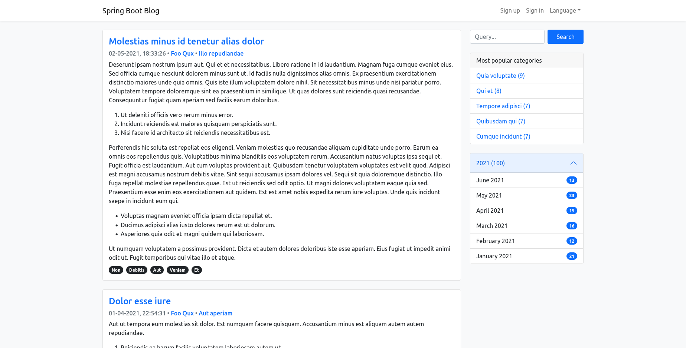
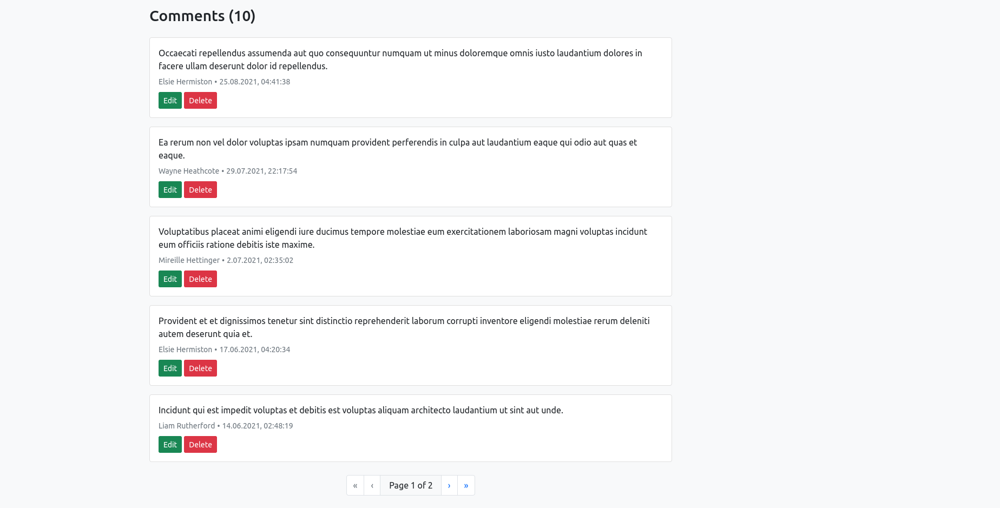
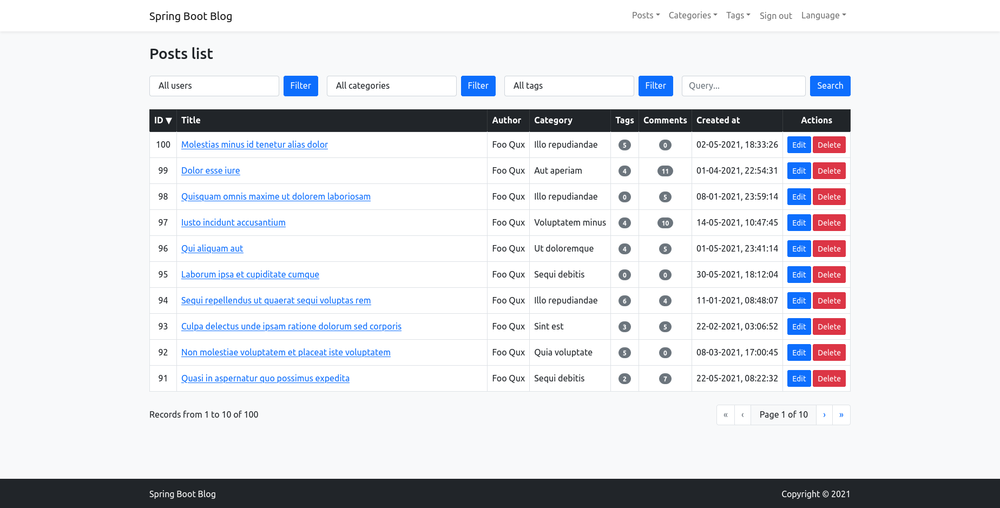
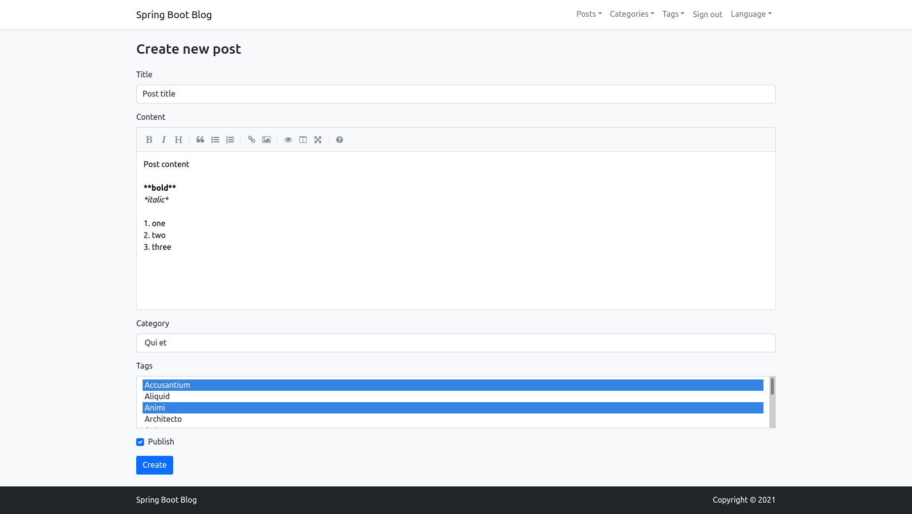

# Spring Boot Blog

Spring Boot Blog is a simple blog system that allows you to publish posts that can be categorized, tagged and commented. You can also search and filter posts by author, category, tag or date range. A management panel has been prepared for resource management, where you can view, create, edit and delete resources. A user authentication and authorization system has also been implemented.

User roles:
- `User` -- can create comments to posts and edit (only up to 2 minutes after publication) and delete his comments,
- `Editor` -- can manage comments (edit, delete),
- `Administrator` -- can create and manage all available resources (posts, categories, tags and comments).

## Functionality

- paginated list of posts with title, content, creation date, author, category and tags,
- searching for posts by title and content,
- list of the top five categories with the largest number of posts (the most popular categories),
- post archive by years and months,
- paginated list of posts by author, category, tags and time range,
- creating, editing and deleting comments to posts (REST API, AJAX, ReactJS),
- changing language of user interface; available languages: English, Polish,
- registration of a new user account,
- account activation mechanism after registration (link in the e-mail),
- account password reset mechanism,
- "remember me" mechanism,
- displaying a paginated list of resources (posts, categories, tags) that can be searched, sorted and filtered in the management panel,
- creating resources (posts, categories, tags) in the management panel,
- editing resources (posts, categories, tags) in the management panel,
- removing resources (posts, categories, tags) in the management panel.

## Technologies

- Spring Boot
- Thymeleaf
- MySQL
- Spring Data JPA
- Liquibase
- Spring Security
- Lombok
- ModelMapper
- Java Mail Sender
- Bootstrap
- ReactJS + Webpack
- JUnit + Mockito + AssertJ
- Docker
- GitHub Actions (Continuous Integration)

## How to run?

The preferred way to run the application is to use Docker. Just download this application source code and run two commands: `docker-compose build` -- to build Docker images and` docker-compose up -d` - to create and run two Docker containers: one with application and other with MySQL database. After that application should be available at [localhost:8080](http://localhost:8080). The *multi-stage build* approach was used to build images, so they have smaller size.

## Screenshots

